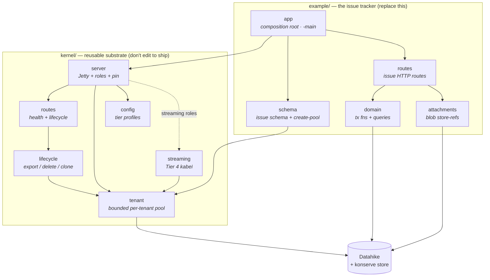
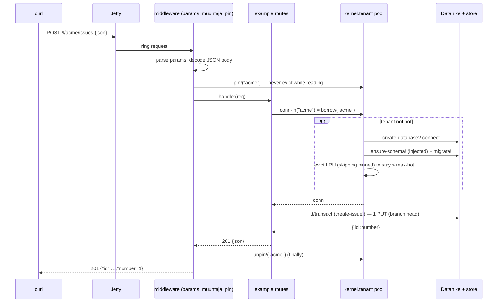
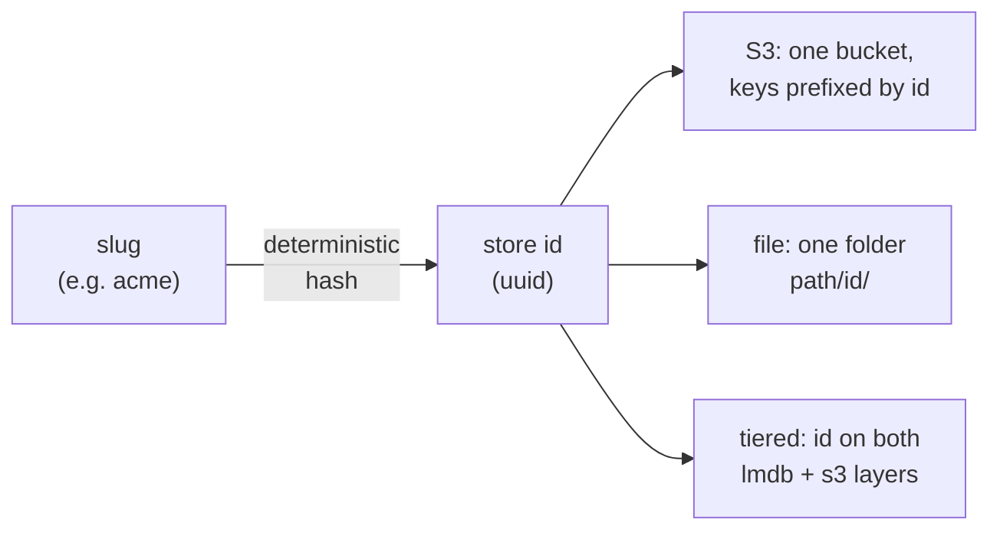
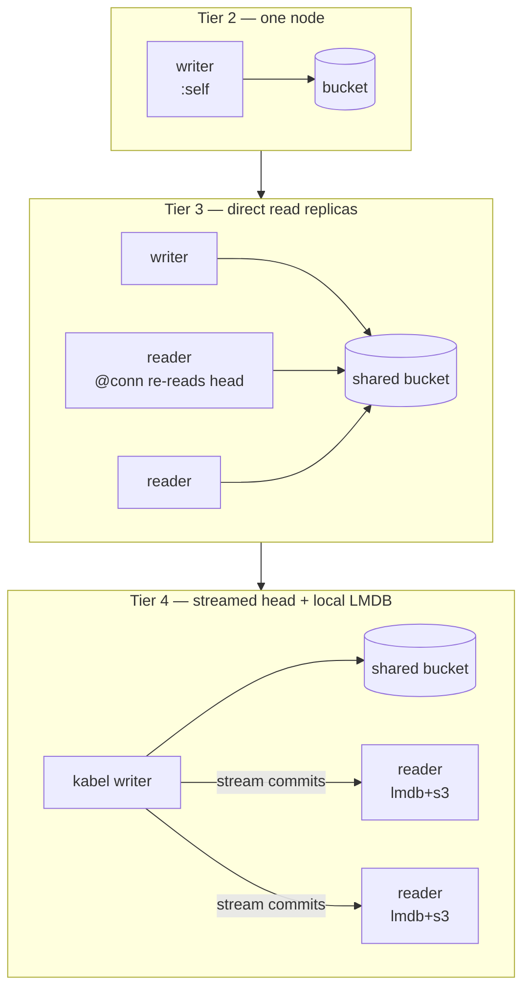

# Architecture

How the pieces fit — the map to read before the code. The repo splits cleanly in two:

- **`kernel/`** — the reusable substrate for *any* db-per-tenant SaaS on Datahike. It knows
  nothing about issues. You do not edit it to ship.
- **`example/`** — the issue tracker. This is what you replace with your own domain. It
  depends on the kernel; the kernel never depends back.

If you want to build your own SaaS, read [`building-your-own.md`](building-your-own.md) — the
short version is *delete `example/`, write four small files*.

## Module dependencies

The arrows only ever point **example → kernel**. That is the invariant the split enforces:
nothing in `kernel/` names anything in `example/`.

**The two seams the kernel exposes** (both injected at `server/start!` by `example/app`):

| seam | type | what the example supplies |
|---|---|---|
| `:ensure-schema` | `conn -> conn` | `example.schema/ensure-schema!` — installed once per tenant on open |
| `:routes-fn` | `conn-fn -> route-data` | `example.routes/routes` — concatenated after the kernel's own health/lifecycle routes |

The kernel's pool (`tenant/create-pool`) also takes `:migrations` (a resource dir, default
`"migrations"`). That is the *entire* contract. `example.schema/create-pool` bundles the
`:ensure-schema` injection into a one-liner the REPL and benches reuse.

## A request, end to end

What happens when a write hits the running service. The **pin** is the load-bearing detail:
it is what lets the bounded pool evict connections without ever closing one mid-query.

Reads are the same path without the transact. `@conn` returns the in-memory db on the writer
(`:self`), or re-reads the branch head from the store on a Tier-3 reader (non-streaming
writer backend), or follows the kabel stream on a Tier-4 reader.

## One database per tenant → one store id

A tenant slug maps deterministically to a store id, and that id is *how* tenants are kept
apart. The mechanism differs by backend but the code (`tenant/tenant-cfg`) is one `case`:

(the hash is `tenant/tenant-id->uuid` — deterministic, so a slug always maps to the same id)

So on S3 **all tenants share one bucket and one set of credentials** — that is the economic
argument. Offboarding a tenant is `d/delete-database` on its id; GDPR erasure is complete by
construction because the tenant's data lives under no other id.

## The scaling ladder

Every rung uses the **same store (object storage) and the same domain code**. Moving up adds
*processes*, never a different database — the `:store` profile in `config.edn` and the
`SAAS_ROLE` env var are the only things that change. Full design in
[`ladder.md`](ladder.md).

| rung | when | what changes | `SAAS_ROLE` |
|---|---|---|---|
| **Tier 2** | you have users | the bucket (`SAAS_TIER=tier2`) | unset / `writer` |
| **Tier 3** | reads exceed one node (~300 ops/s) | run more reader processes | `reader` |
| **Tier 4** | the read *tail* hurts, or the working set exceeds RAM | a kabel writer + tiered store | `writer-streaming` / `reader-streaming` |

The two role mistakes that would otherwise be **silent** — an unknown role, or a replica left
on the default `:self` (streaming) writer that serves a frozen snapshot — are rejected or
warned at startup by `server/check-role!`.

## What makes it economical

A tenant is only cheap if a small commit costs about **one PUT**. Three store-fixed knobs
(identical across every tier, in `config.edn`) get it there — see
[`cost-model.md`](cost-model.md) for the measurements and dollars:

| knob | buys | costs |
|---|---|---|
| `:fuse-index-roots? true` | −1 PUT per index touched (2–6/commit) | a fatter db record; shares less |
| `:index-config {:diff-buf-size 256}` | ~25× less stored-object growth | CPU on cold full scans, not IO |
| `:commit-graph? false` | −1 PUT/commit (provenance object) | gives up branch/ancestry/merge |

Time travel (`as-of`/`history`) is a *separate* knob (`keep-history?`), unaffected by these.
